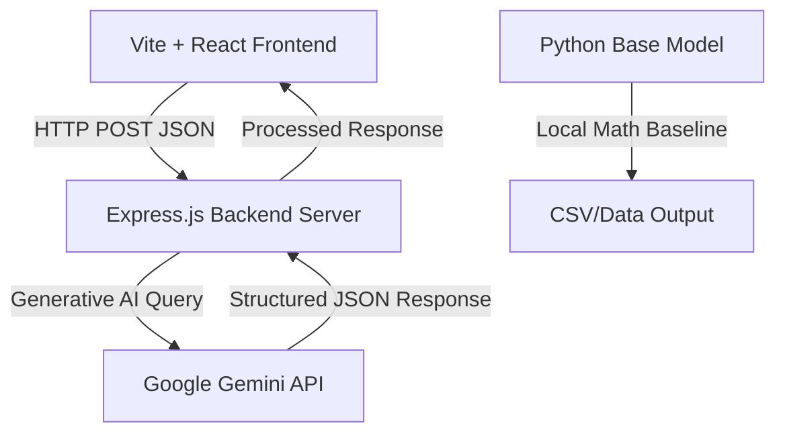

# Multi-Modal Agricultural Decision Making & Growth Optimization Software

🌱 **An AI-powered agricultural growth enhancer and plant disease diagnostic system.** 

This project is the official implementation accompanying the research paper published in the **International Journal of Scientific Research in Engineering and Management (IJSREM)** (UGC Approved, Impact Factor: 8.0+).

The application uses a hybrid approach: **deterministic baseline calculations** (soil/temperature math) combined with **state-of-the-art Generative AI** (Google's Gemma & Gemini model family) to analyze soil types, environmental temperature, and plant health to generate real-time growth optimization strategies and pathologist-level disease treatments.

---

## 📋 Table of Contents
1. [Key Features](#-key-features)
2. [Architecture Overview](#-architecture-overview)
3. [Tech Stack & Dependencies](#-tech-stack--dependencies)
4. [Environment Setup & API Keys](#-environment-setup--api-keys)
5. [Installation & Running the Application](#-installation--running-the-application)
6. [API Model Selection & Future Upgrades](#-api-model-selection--future-upgrades)
7. [Python Mathematical Baseline](#-python-mathematical-baseline)
8. [Research Citation & Context](#-research-citation--context)

---

## 🌟 Key Features

*   **Growth Optimization & Care Predictor:** Recommends precise water requirements (adjusted for heat stress), N-P-K-Ca nutrient dosage, and optimal pH ranges based on local climate and soil types.
*   **Yield & Financial Calculator:** Analyzes farm size to estimate harvest timelines, production yields in tons, projected market values, fertilizer costs, and profit margins.
*   **Plant Pathologist Diagnosis:** Analyzes plant symptoms to diagnose diseases, estimate severity and confidence levels, and provide chemical/organic treatments.
*   **Structured JSON Output Pipeline:** Employs precise system prompts with strict JSON schema enforcement for stable, clean UI rendering.

---

## 🏗️ Architecture Overview



### Repository Structure
*   `agro-frontend/`: React + Vite application (interactive dashboard, responsive UI, micro-animations, glassmorphism design).
*   `agro-backend/`: Node.js Express server interfacing with the Google Generative AI API.
*   `Main.py`, `Plant.py`, `temp_adj.py`: Python mathematical baseline calculations for plant requirements.
*   `Agro Flow Chart - By Vaibhav.png`: Visual process flow chart.
*   `database_workflow_1780813570558.png`: Visual representation of data schema workflow.

---

## 💻 Tech Stack & Dependencies

### Frontend
*   **Framework:** React 18+ (Vite builder)
*   **Styling:** Modern Vanilla CSS (Sleek dark mode, custom keyframe animations, glassmorphism)
*   **Build tool:** Vite

### Backend
*   **Server Framework:** Express.js (Node.js)
*   **Gemini SDK:** `@google/generative-ai`
*   **Helpers:** `dotenv`, `cors`

### Python Baseline
*   `pandas`
*   `tqdm`

---

## 🔑 Environment Setup & API Keys

The backend relies on the Google Gemini API to run its reasoning models.

1.  Go to the [Google AI Studio](https://aistudio.google.com/) and generate a free or pay-as-you-go **Gemini API Key**.
2.  Create a `.env` file inside the `agro-backend` directory:
    ```env
    PORT=3001
    GEMINI_API_KEY=your_actual_api_key_here
    ```

> [!WARNING]
> Never commit your `.env` file to public version control. It has already been excluded globally via the root `.gitignore` file.

---

## 🚀 Installation & Running the Application

### 1. Start the Backend
Navigate to the backend directory, install dependencies, and run the server:
```bash
cd agro-backend
npm install
npm run dev
```
The backend will launch at `http://localhost:3001`.

### 2. Start the Frontend
In a separate terminal, navigate to the frontend directory, install dependencies, and run the development server:
```bash
cd agro-frontend
npm install
npm run dev
```
Open `http://localhost:5173` in your browser.

### 3. Run Python Calculations (Optional Baseline)
Install Python dependencies and execute the baseline scripts:
```bash
pip install pandas tqdm
python Main.py
```

---

## 🤖 API Model Selection & Future Upgrades

### Model Configuration
Currently, the backend is configured to use Google's highly efficient **`gemma-3-27b-it`** model for structured reasoning:
```javascript
const model = genAI.getGenerativeModel({ model: 'gemma-3-27b-it' });
```

### Upgrading the Model with Time
As Google updates its model lines (e.g., to future iterations of Gemma or Gemini 1.5 Pro / Flash), you can modify the model string inside [agro-backend/index.js](file:///c:/Users/Vaibhav/OneDrive/Desktop/Agro/agro-backend/index.js).

Recommended production model upgrades:
*   **Gemini 1.5 Flash:** `gemini-1.5-flash` (Fast, highly cost-effective, ideal for general chat/diagnose)
*   **Gemini 1.5 Pro:** `gemini-1.5-pro` (Best for high-complexity math, multi-modal image inputs, and deep reasoning)

### Schema Control (Structured Output)
To ensure the backend never returns raw text that could crash the UI, all API requests include a structured system prompt declaring a strict JSON schema. If updating the model, ensure that the target model supports JSON mode or structured outputs.

---

## 📊 Python Mathematical Baseline
The included Python scripts (`Main.py`, `Plant.py`, and `temp_adj.py`) demonstrate the deterministic mathematical baseline used to validate the AI models. It calculates:
$$\text{Adjusted Water} = \text{Base Water} + (\Delta T \times \text{Temperature Adjustment Factor})$$
$$\text{Adjusted Nutrition} = \text{Base Nutrition} + (\Delta T \times \text{Nutritional Adjustment Factor})$$

This double-check pipeline ensures that the generative AI recommendations stay closely bounded within scientifically proven thresholds.

---


